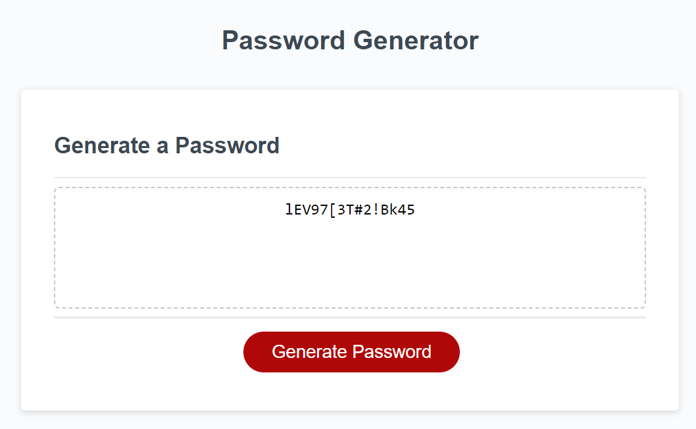

# Password-Generator

# Description
The task for this assignment requires to create an application that an employee can use to generate a random password based on criteria they’ve selected.

Generate a password when the button is clicked

Present a series of prompts for password criteria
<ul>
<li>Length of password: At least 10 characters but no more than 64.</li>
<li>Character types: 
<ul>
<li>Lowercase</li>
<li>Uppercase</li>
<li>Numeric</li>
<li>Special characters ($@%&*, etc)</li>
</ul>
</ul>

# Screenshot

# Links
<ul>
  <li>GitHub Repository: https://github.com/valimanea/Password-Generator/</li>
  <li>Deployed application: https://valimanea.github.io/Password-Generator/</li>
</ul>